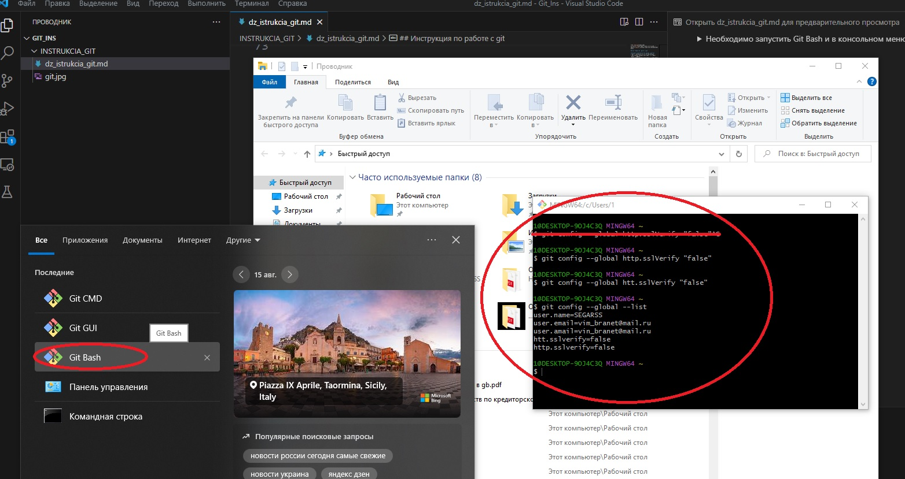
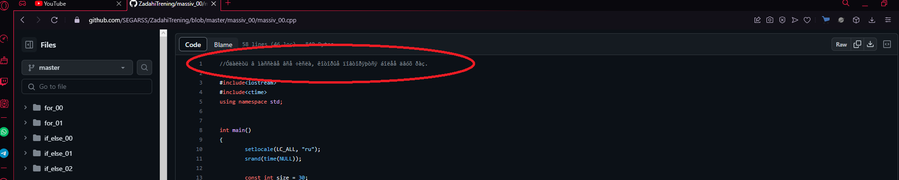
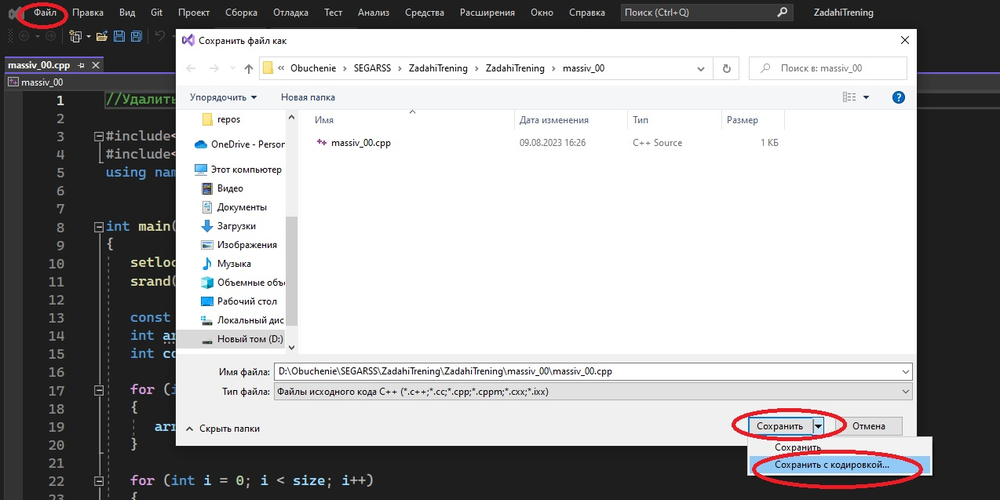
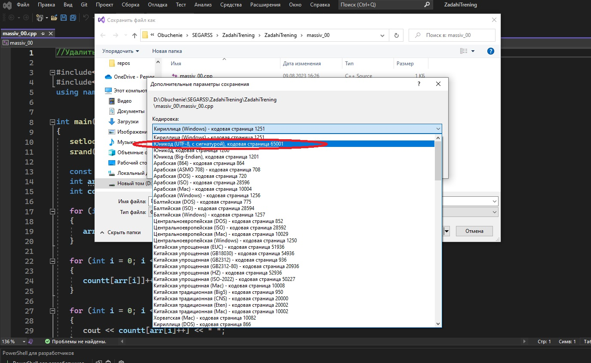

## Инструкция по работе в Visual Studio 2022

**Когда случаються проблемы с репозиториями, работая в программе - Visual Studio 2022**
1. Распространнённая ошибка, неудаёться отправить или клонировать репозиторий.

 Необходимо запустить Git Bash и в консольном меню прописать команды.

1. git config --global http.sslVerify "false"
2. git config --global htt.sslVerify "false"
3. git config --global --list
* После это, можно также наглядно в консоли увидеть, на какой удалённый репозиторий ссылаетьс гит почта и кто будет управлять(имя)

 

#

2. Файл .gitignore черезвычайно важен. А именно:
* Самое главное что в нём прописанно, я прикрепил к инструкции данный файл, он должен присутствоват ьв каждой папке проекта, чтобы небыло проблем с отправкой репозитория.
* Последняя проблема была связанная с тем что, в нутри файла .gitignore небыло прописанно строчки - *.jfm, казолось бы мелоч, а потратить моного времени чтоб понять в чом проблема.
3. После того, как создали - клонировали репозиторий, чтобы его отправить или получить изминения с git, необходимо создать файл(прописать команду в терминале) git init, создать файл в нутри репозитория .gitignore, затем закрыть проект и саму программу, открыть заново, и после этого можно и принимать изминения и отправлять изминения на git hab.

**Когда случаються проблемы, связанная с эроглифами при загрузке на GitHab из - Visual Studio 2022**

 При отправки репозитория из Visual Studio 2022 на GitHab, мы можем получить такаю картину.

Исправляеться она следуюющим образом.

 открываем репозиторий, с которым произошёл сбой. Далее файл - Сохранить (название файла) как.., и сдесь самое главное выбрать кодировку UTF-8 65001.

после этих действий, сделать повторную отправку на GitHab.

#

**Горячие и полезные клавиши**
* Клавиша Alt - при её зажатии, можно выделить код по вертикали, чтобы в двух к примеру строчка исправить одну и туже кодировку.
* Выделив название кода, нажав комбинацию, Ctrl + Shift + F, мы вызовим функционал поиска данного кода по всем разделам, и можем просмотреть, везде где он применяеться а также можем его сразу зараз везде изменить.
Ко всему, мы видим в терминале, сразу везде где данный код присутствует. 
* Также другой вариант замены или поиска, выделив код, нажимаем Ctrl + F, также можем прощёлкать везде и просмотреть где данный код используеться, а также заменить его в одном месте, или во всех сразу. В терминале информация о коде, при такой комбинации, отображаться не будет.
* Если нажать сборку F7, мы соберём решение файла в котором непосредственно работаем. Если же нажмём пересобрать решение Ctrl + Alt + F7,
мы непосредственно пересоберём весь проект, и увидим ошибки (если они есть) всего проекта, всех файлов без исключений.
* Выбрав строчку кода, и нажав F12 мы попадём в главное объявление данного кода, а затем нажав F3, вернёмся обратно туда где она прописана и используеться.
* Стоя на коде, комбинация Ctrl+Shifr+H, даёт возможно массового поиска кода а также массовой замены кода(переименование)
* ЧТобы выровнить весь код, пробелы отступы и так далее, выделяем часть кода или весь код, и нажимаем комбинацию Ctrl+K+F.
